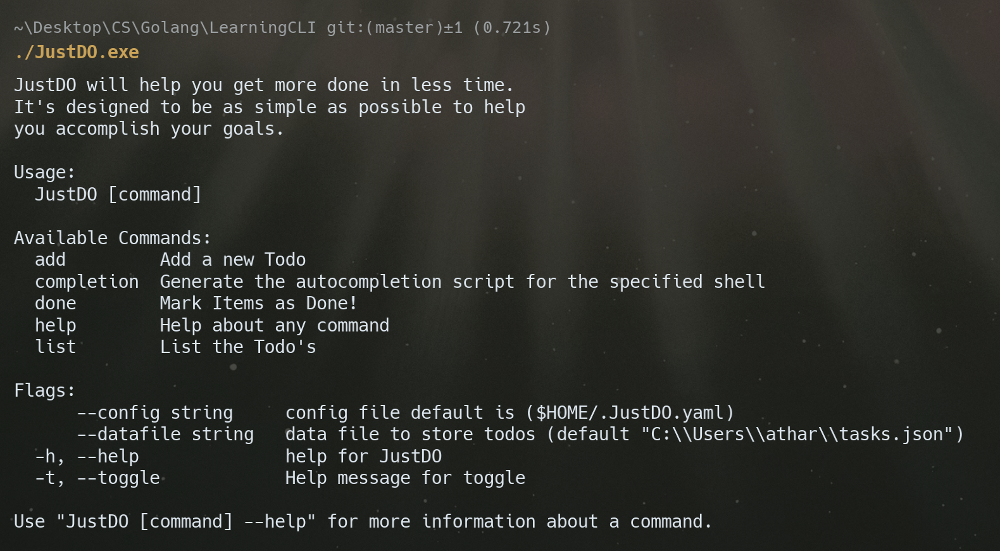

# 📝 JustDO – A Simple CLI Todo Manager

JustDO is a minimalistic command-line Todo application written in Go.  
It helps you stay productive by managing tasks straight from your terminal with support for flags, priorities, marking done, and persistent storage.

---




## 🚀 Features

- ✅ Add, list, and complete tasks
- 🎯 Set priority levels to sort your list
- 🗂️ View all tasks or filter by pending/done
- 📁 Persistent storage using JSON
- ⚙️ Configurable via `--datafile` flag, ENV vars, or `.JustDO` config file
- 🔧 Viper-based config + optional `.env` support
- 💡 Cross-platform (Windows/Linux/Mac)

---

## 📦 Installation

### 🔹 Option 1: Homebrew (macOS/Linux)

```bash
brew tap atharvwasthere/tap
brew install justdo
````

### 🔹 Option 2: Scoop (Windows)

```powershell
scoop bucket add justdo https://github.com/atharvwasthere/scoop-bucket
scoop install justdo
```

### 🔹 Option 3: Go Install (requires Go toolchain)

```bash
go install github.com/atharvwasthere/JustDO@latest
```

### 🔹 Option 4: Manual Download

Head over to the [Releases](https://github.com/atharvwasthere/JustDO/releases) page and download the binary for your OS/arch.

### 🔹 Option 5: Build from Source

```bash
git clone https://github.com/atharvwasthere/JustDO.git
cd JustDO
go build -o justdo .
```

---

## 🛠️ Usage

### ➕ Add a Task

```bash
./JustDO.exe add "Finish writing CLI tool"
```

### 📋 List Tasks

```bash
./JustDO.exe list
```

### ✅ Mark a Task as Done

```bash
./JustDO.exe done 1
```

---

## ⚙️ Configuration

You can control where tasks are saved using:

### 1. `--datafile` Flag (highest priority)

```bash
./JustDO.exe list --datafile="C:/path/to/tasks.json"
```

### 2. Environment Variable

```bash
DATAFILE="C:/path/to/tasks.json" ./JustDO.exe list
```

### 3. Config File

Create a file named `.JustDO.yaml` in your `$HOME` directory:

```yaml
datafile: "C:/path/to/tasks.json"
```

---

## 🧪 Dev Log

Latest changes:

* `feat:` Added full config/env support via Viper
* `feat:` Task filtering with `--done` and `--all` flags
* `feat:` Mark tasks as done
* `feat:` Set priority for tasks
* `refactor:` Better output formatting
* `fix:` Clean handling of flags and config precedence

---

## 📁 File Structure

```
.
├── cmd/           # Cobra command definitions
├── todo/          # Task model & file handling logic
├── tasks.json     # Default storage file
├── main.go        # Entry point
├── go.mod         # Dependencies
└── README.md      # You're here
```

---

## 🙌 Author

**Atharv Singh**
📧 [singhatharv1919@gmail.com](mailto:singhatharv1919@gmail.com)
🐙 [@atharvwasthere](https://github.com/atharvwasthere)

---

## 🪪 License

MIT License — see [LICENSE](./LICENSE)


